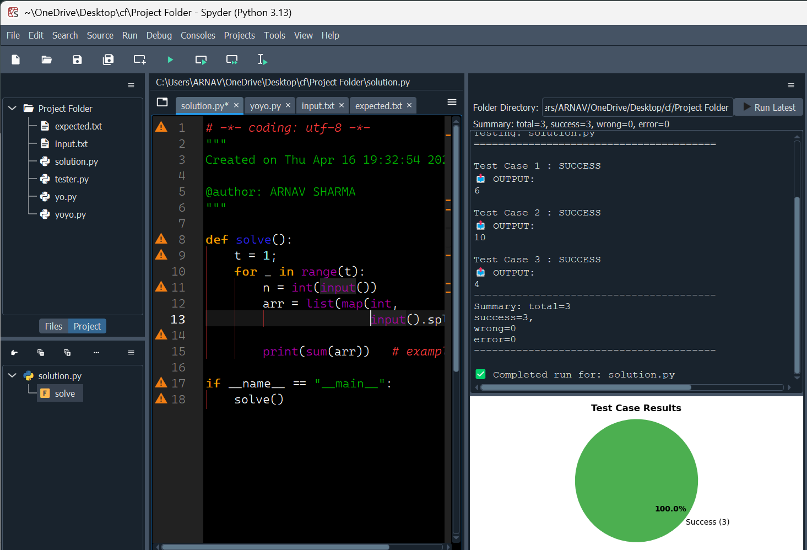

# Spyder AutoJudge

Spyder AutoJudge is a lightweight Spyder plugin for quickly checking the latest Python file in a folder against `input.txt` and `expected.txt` test cases.

[Project on PyPI](https://pypi.org/project/spyder-autojudge/)

## What it does

- Finds the most recently modified `.py` file in the selected folder.
- Runs that file against test cases from `input.txt` and compares output with `expected.txt` when you click `Run Latest`.
- Shows a clear summary for success, wrong output, and runtime error cases.
- Draws a pie chart using `matplotlib` (installed with this package).

## Why Spyder AutoJudge exists

If you like building small competitive-programming style workflows inside Spyder, this plugin keeps the feedback loop simple:

- write code
- save the file
- run the latest version
- see results immediately

It is intentionally minimal, so it feels close to the workflow used by small Python tools in the wild: one clear task, one short path to test it, and a straightforward result panel.

## Requirements

- Python 3.9 or newer
- Spyder 5.4 or newer

`matplotlib` is installed automatically as a dependency of `spyder-autojudge`.

## Install

Install from PyPI:

```bash
pip install spyder-autojudge
```

If Spyder is already open, restart it after installation so the plugin is discovered.

To verify the package is installed:

```bash
python -m pip show spyder-autojudge
```

## Use

1. Open Spyder.
2. Open the AutoJudge pane.
3. Choose the folder containing your solution and test files.
4. Make sure the folder has these files:
   - one or more Python files
   - `input.txt`
   - `expected.txt`
5. Click `Run Latest`.

AutoJudge picks the newest `.py` file in that folder and runs it case by case.

### Folder example

```text
your-problem-folder/
  solution.py
  scratch.py
  input.txt
  expected.txt
```

### Test file format

Use blank lines to separate cases in both files. The number of cases must match.

`input.txt` example:

```text
2
3

10
20
```

`expected.txt` example:

```text
5

30
```

### Output states

- Success means the program output matched the expected output.
- Wrong output means the program ran but did not match.
- Error means the program hit a runtime error, timeout, or execution problem.

### Chart view

When `matplotlib` is installed, the results panel shows a pie chart for:

- success
- wrong
- error

If there are no test results yet, the chart area shows a placeholder message instead.

### Working screenshot



## Contributing

Contributions are welcome. If you would like to report an issue, suggest an improvement, or send a pull request, start with [CONTRIBUTING.md](CONTRIBUTING.md).

Good first contributions usually include:

- documentation improvements
- small UI polish
- test file handling edge cases
- clearer error messages


## Release

Publishing is handled from GitHub Actions using the release workflows in this repository.

## License

MIT License. See [LICENSE](LICENSE).
